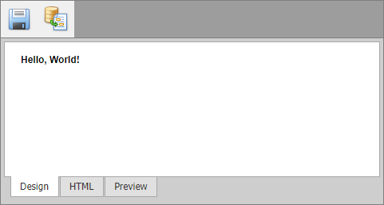

<!-- default badges list -->

<!-- default badges end -->

# HTML Editor for ASP.NET Web Forms - How to save/load the control's content to/from a database
<!-- run online -->
**[[Run Online]](https://codecentral.devexpress.com/e2225/)**
<!-- run online end -->

This example demonstrates how to create [custom toolbar buttons](https://docs.devexpress.com/AspNet/4084/components/html-editor/concepts/toolbars/menu-toolbar/menu-toolbar-items/custom-toolbar-items) that allow users to save and load content of [ASPxHtmlEditor](https://docs.devexpress.com/AspNet/DevExpress.Web.ASPxHtmlEditor.ASPxHtmlEditor) in a database.

## Files to Review

* [Default.aspx](./CS/WebSite/Default.aspx) (VB: [Default.aspx](./VB/WebSite/Default.aspx))
* [Default.aspx.cs](./CS/WebSite/Default.aspx.cs) (VB: [Default.aspx.vb](./VB/WebSite/Default.aspx.vb))

## More Examples

* [HTML Editor for ASP.NET Web Forms - How to bind the Html property to a database field](https://github.com/DevExpress-Examples/asp-net-web-forms-html-editor-bind-html-property-to-database)
